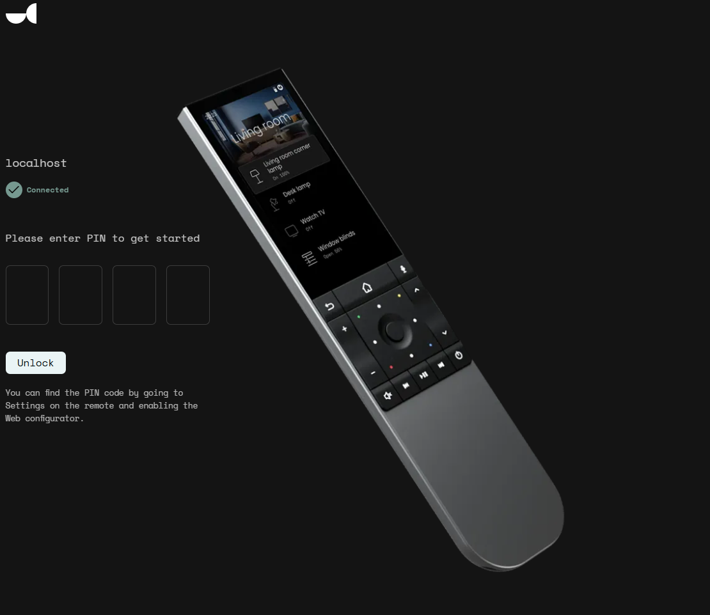
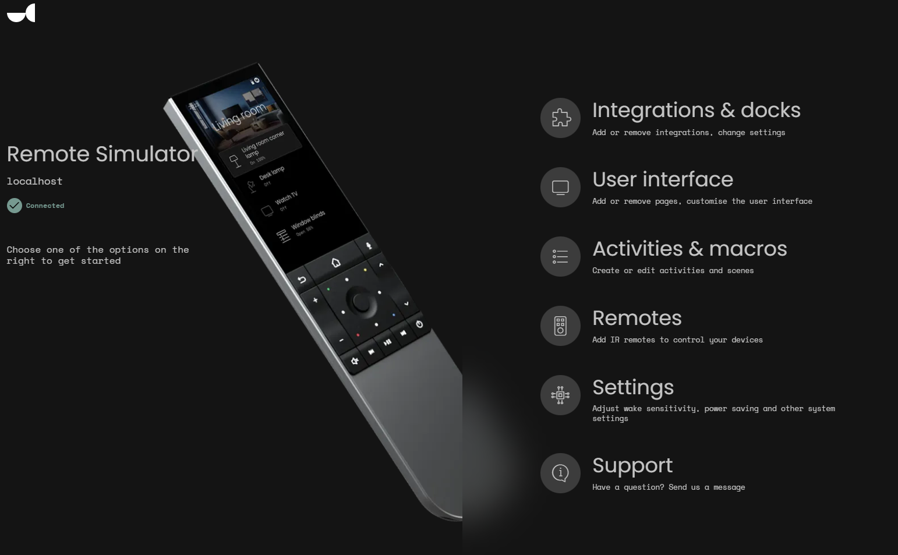
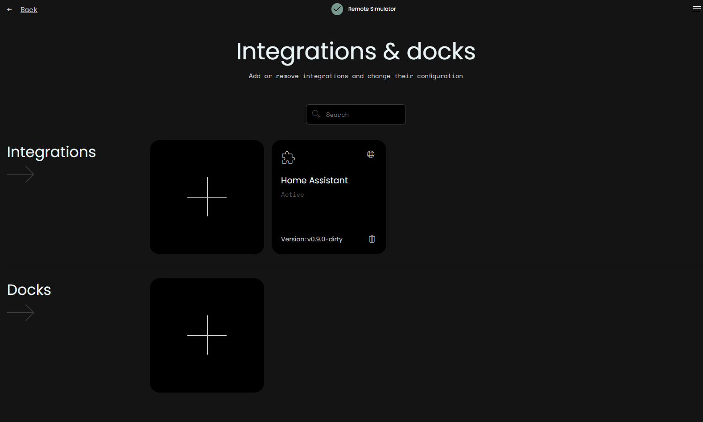
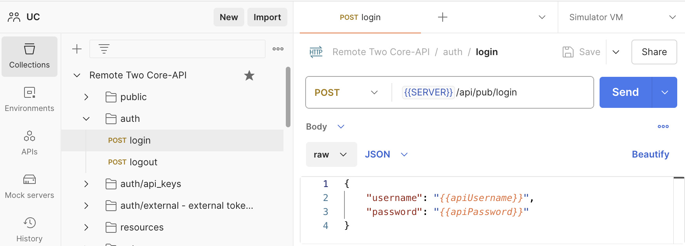
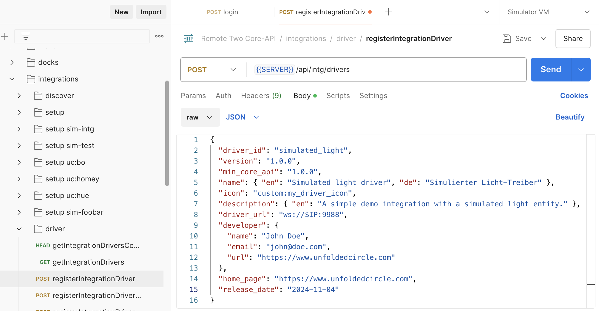
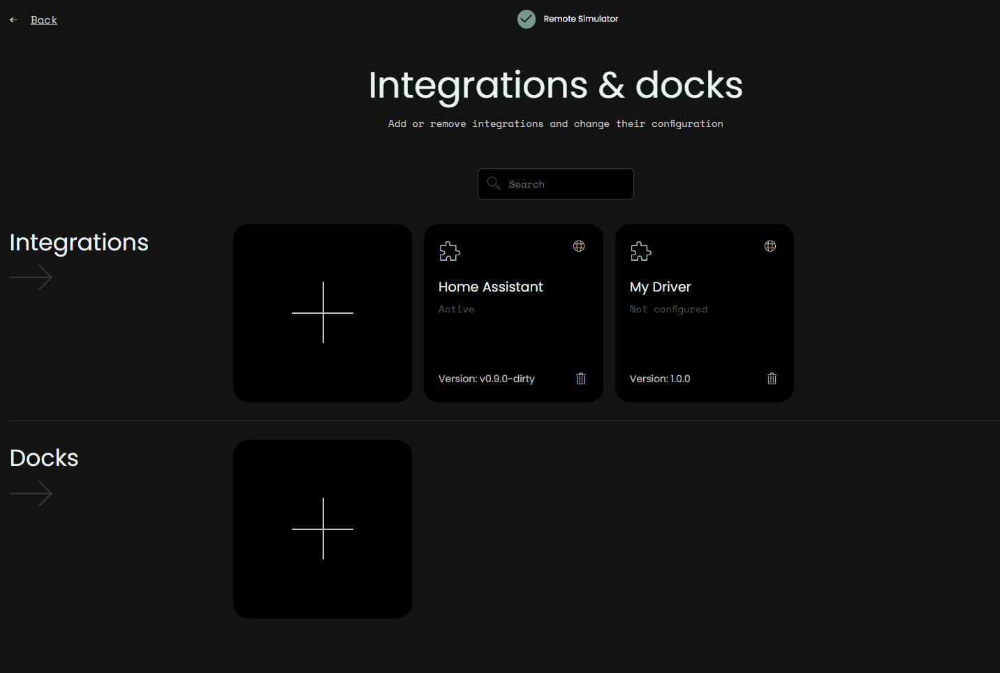
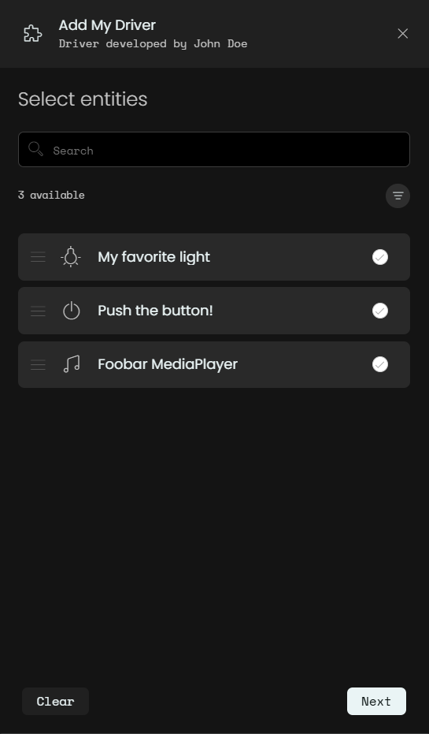

# Remote Two/3 TypeScript Integration Driver Example

This project implements a simple integration driver in TypeScript for the [Unfolded Circle Remote Two and 3 devices](https://www.unfoldedcircle.com/)
using the [UC Integration-API Node.js API wrapper](https://github.com/unfoldedcircle/integration-node-library).

It can be used as a quick start template for writing custom integration drivers.

This example creates three sample entities: a light, a media-player, and a button.

## Usage

This simple example loads the driver configuration file [src/light-driver.json](src/light-driver.json) from the same
directory as the driver file.

Logging in the `@unfoldedcircle/integration-api` package is directed to the [debug](https://www.npmjs.com/package/debug)
module. To let the UC API wrapper output anything, run your integration driver with the `DEBUG` environment variable set
like `DEBUG=ucapi:*`.

See [API wrapper logging](https://github.com/unfoldedcircle/integration-node-library?tab=readme-ov-file#logging) for
more information.

Install dependencies and development tools (like the tsc TypeScript compiler):

```shell
npm install
```

Compile TypeScript:

```shell
npm run build
```

Start the driver:

```shell
DEBUG=ucapi:* node dist/src/light.js
```

The driver is now discoverable by the Remotes, or can be manually registered in the Simulator.

A full walk-through is described in the next section.

## Development Guide

### Development Environment

- macOS, Linux or Windows are all suitable for developing an integration driver.
- A modern IDE with TypeScript support is not required but highly recommended, for example Visual Studio Code or
  JetBrains WebStorm.
- [Node.js](https://nodejs.org/) version 20.16 or newer
- Node.js API wrapper for the UC Integration API. This is an NPM package to quickly use the WebSocket Integration-API.

```shell
npm install @unfoldedcircle/integration-api
```

#### Remote-Core Simulator

If you have a Remote Two or Remote 3 device, then you can directly use the physical devices to develop an integration
driver. Otherwise, the [Remote-Core Simulator](https://github.com/unfoldedcircle/core-simulator) provides a device
simulation for most features.

- **Container runtime**: the [Remote-Core Simulator](https://github.com/unfoldedcircle/core-simulator) is distributed as
  a container image.
  This requires a container runtime on your machine, for example Docker or Podman.

- **Remote-Core Simulator**: Download the [Remote-Core Simulator](https://github.com/unfoldedcircle/core-simulator).
  Change into the `./docker` directory and run the pre-configured Docker Compose services:

Run:

```shell
docker compose up
```

You should see messages similar to this in the terminal:

```
docker compose up
[+] Running 3/0
 ✔ Container home-assistant-demo  Created                                                                                                                                                                                                                                            0.0s
 ✔ Container core-simulator       Created                                                                                                                                                                                                                                            0.0s
 ✔ Container integration-hass     Created                                                                                                                                                                                                                                            0.0s
Attaching to core-simulator, home-assistant-demo, integration-hass
integration-hass     | [2024-11-04T16:55:04Z INFO  uc_intg_hass] Loading default configuration file: configuration.yaml
integration-hass     | [2024-11-04T16:55:04Z INFO  uc_intg_hass::configuration] No user settings file found
integration-hass     | uc-intg-hass listening on: 0.0.0.0:8000
integration-hass     | [2024-11-04T16:55:04Z INFO  uc_intg_hass::server::mdns] Registered service: hass._uc-integration._tcp.local.
integration-hass     | [2024-11-04T16:55:04Z INFO  actix_server::builder] starting 1 workers
integration-hass     | [2024-11-04T16:55:04Z INFO  actix_server::server] Actix runtime found; starting in Actix runtime
core-simulator       | Core-API listening on: 0.0.0.0:8080
core-simulator       | Core-API listening on: 0.0.0.0:8443
```

Open <http://localhost:8080/configurator>` in a browser to login to the Web-Configurator of the Remote Two Core Simulator:

Enter the pin, then click "Unlock".
See [Simulator documentation](https://github.com/unfoldedcircle/core-simulator?tab=readme-ov-file#user-accounts-1) for
the pin.



After unlocking the Web-Configurator, you are greeted with the following page:



Go to "Integrations & docks" to see added integrations. Initially, only the "Home Assistant" integration should appear
(which is part of the Docker Compose setup):



#### REST client

The Simulator requires to manually register integration drivers with the Core-API. Automatic service discovery is not
working inside the container image.

This can be done with curl on the command line, or with a visual REST client like [Postman](https://www.postman.com) or
[Bruno](https://www.usebruno.com/).

This guide will use Postman and show the corresponding curl requests.
The prepared [Remote Two Core-API Postman collection](https://github.com/unfoldedcircle/core-api/blob/main/core-api/rest/remote-core_rest-api.postman_collection.json)
helps you get started.

#### Core-API Authentication

Most Core-API endpoints require authentication. Credentials can be provided for each request or through a cookie based
session login.

- The Postman collection is configured to use the session based login.
- When working with curl, it's usually easier to set the credentials in each request.

To log in with admin rights, use the `/auth/login` endpoint:

```json
{
  "username": "{{apiUsername}}",
  "password": "{{apiPassword}}"
}
```



- username: `web-configurator`
- password: same pin as when logging in to the web-configurator

It's recommended to store credentials in the "current value" of a variable. If you have multiple Remote devices or use
the Simulator with a real device, use environments to quickly switch between different servers.

When using curl, use the `--user $USER:$PASSWORD` parameter.

### Start Integration Driver

Compile and start the driver:

```shell
npm run build
DEBUG=ucapi:* node dist/src/light.js
```

The terminal should show messages similar to:

```
DEBUG=ucapi:* node light.js
  ucapi:debug Driver info loaded +0ms
  ucapi:debug Starting mdns advertising +2ms
  ucapi:info Driver is up: simulated_light, version: 1.0.0, listening on: 0.0.0.0:9988 +0ms
  ucapi:debug Light entity created with id: my_unique_light_id +1ms
  ucapi:debug ENTITIES(available): Entity added: my_unique_light_id +0ms
  ucapi:debug Button entity created with id: my_button +1ms
  ucapi:debug ENTITIES(available): Entity added: my_button +0ms
  ucapi:debug MediaPlayer entity created with id: test_mediaplayer +0ms
  ucapi:debug ENTITIES(available): Entity added: test_mediaplayer +0ms
```

Leave this terminal running, now it's time to register the driver in the Simulator.

### Driver Registration

In Postman, send the `/integrations/driver/registerIntegrationDriver` request, adjusted to your driver and network settings.

‼️ Replace `$IP` in `driver_url` with the IP address where your integration driver is running. This must be a reachable
IP address from the container network. It is usually the IP address of the network interface connected to your router.



Curl request:

```shell
curl 'http://localhost:8080/api/intg/drivers' \
--user web-configurator:$PIN \
--header 'Content-Type: application/json' \
--data-raw '{
  "driver_id": "simulated_light",
  "version": "1.0.0",
  "min_core_api": "1.0.0",
  "name": { "en": "Simulated light driver", "de": "Simulierter Licht-Treiber" },
  "icon": "custom:my_driver_icon",
  "description": { "en": "A simple demo integration with a simulated light entity." },
  "driver_url": "ws://$IP:9988",
  "developer": {
    "name": "John Doe",
    "email": "john@doe.com",
    "url": "https://www.unfoldedcircle.com"
  },
  "home_page": "https://www.unfoldedcircle.com",
  "release_date": "2024-11-04"
}'
```

If successful, you'll see a new message in the terminal when the Simulator communicates with the integration driver:

```
  ucapi:info [::ffff:172.16.16.102:47616] WS: New connection +434ms
  ucapi:msg [::ffff:172.16.16.102:47616] <-  {"kind":"resp","req_id":0,"code":200,"msg":"authentication","msg_data":{}} +0ms
```

The registered driver also appears in the Web-Configurator:



Click on the driver to start the setup. Select all available entities, and finish setup.



The configured entities will produce new log messages in the driver terminal:

```
  ucapi:msg [::ffff:172.16.16.102:52944] -> {"kind":"req","id":3,"msg":"get_available_entities","msg_data":{}} +366ms
  ucapi:msg [::ffff:172.16.16.102:52944] <-  {"kind":"resp","req_id":3,"code":200,"msg":"available_entities","msg_data":{"available_entities":[{"entity_id":"my_unique_light_id","entity_type":"light","features":["on_off","dim"],"name":{"de":"Mein Lieblingslicht","en":"My favorite light"}},{"entity_id":"my_button","entity_type":"button","features":["press"],"name":{"en":"Push the button!"},"area":"test lab"},{"entity_id":"test_mediaplayer","entity_type":"media_player","features":["on_off","dpad","home","menu","channel_switcher","select_source","color_buttons","play_pause"],"name":{"en":"Foobar uc.MediaPlayer"},"device_class":"streaming_box"}]}} +1ms
  ucapi:msg [::ffff:172.16.16.102:52944] -> {"kind":"req","id":4,"msg":"subscribe_events","msg_data":{"entity_ids":["my_unique_light_id","my_button","test_mediaplayer"]}} +8s
  ucapi:debug ENTITIES(configured): Entity added: my_unique_light_id +4m
  ucapi:debug ENTITIES(configured): Entity added: my_button +0ms
  ucapi:debug ENTITIES(configured): Entity added: test_mediaplayer +0ms
Subscribed entity: my_unique_light_id
Subscribed entity: my_button
Subscribed entity: test_mediaplayer
  ucapi:msg [::ffff:172.16.16.102:52944] <-  {"kind":"resp","req_id":4,"code":200,"msg":"result","msg_data":{}} +2ms
```

## License

This project is licensed under the [**Apache License 2.0**](https://choosealicense.com/licenses/apache-2.0/).
See the [LICENSE](https://github.com/unfoldedcircle/integration-node-library/blob/main/LICENSE) file for details.
